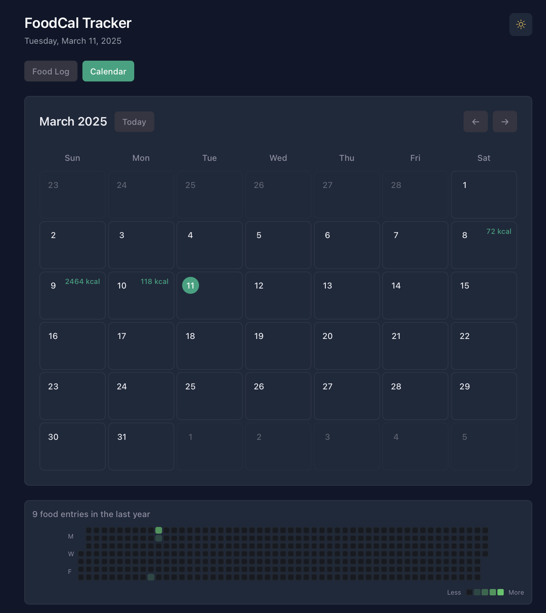

# FoodCal

FoodCal is your personal nutrition companion that makes calorie tracking beautiful and effortless.

"Tracking calories shouldn't feel like doing taxes" - Our Design Philosophy

## How does it work?

If you want to:

**Track Your Journey** - Open the calendar view and start logging your meals. Each day shows your progress with beautiful visual indicators, and you can quickly add food entries or view your logs with just a tap.

**See The Big Picture** - Check out the yearly overview that shows your nutrition patterns in a GitHub-style contribution graph. Watch as your daily entries paint a picture of your journey through different shades of green.

**Stay Organized** - Categorize your meals, track your daily calories, and manage your food logs all in one place. The interface adapts to your needs, whether you're planning ahead or reviewing past entries.

## App Preview

  
     
  

## Features

### 🗓️ Monthly Calendar View

-   Interactive day selection with smooth animations
-   Quick actions for food logging and viewing entries
-   Visual progress indicators for each day
-   System-consistent styling that's easy on the eyes

### 📊 Yearly Overview

-   Beautiful contribution graph showing your nutrition patterns
-   Color-coded intensity levels that tell your story
-   Full year view with elegant month labels
-   Inspired by GitHub's contribution chart

### 🍽️ Food Logging

-   Effortless meal entry with type categorization
-   Smart calorie tracking with daily summaries
-   Intuitive log management by date
-   Quick actions for common tasks

## Design Philosophy

FoodCal is built with love and attention to detail:

-   Dark mode that's actually pleasant to use
-   Consistent design system that feels natural
-   Responsive layout that works everywhere
-   Smooth animations and transitions

## Tech Stack

Built with modern technologies for the best experience:

-   React + Vite for fast development and performance
-   Tailwind CSS for beautiful, responsive design
-   TypeScript for type safety and reliability
-   Firebase (Firestore) for backend and real-time data
-   Modern React patterns and hooks

## Coming Soon

-   Weekly nutrition insights and trends
-   Custom food database integration
-   Meal planning features
-   Social sharing capabilities
-   Mobile app companion
